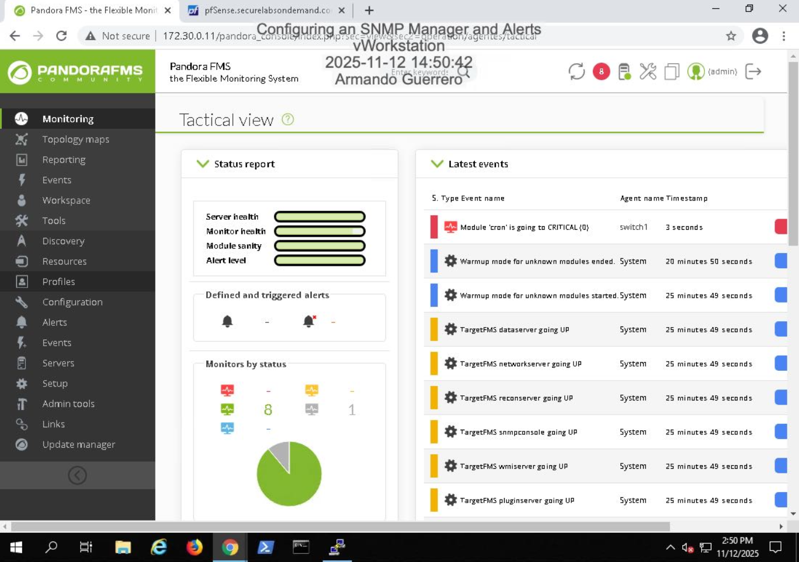

# SNMP Monitoring & Alert Configuration 

## Overview
Configured an SNMP agent and monitoring system to enable proactive performance monitoring and trap-based alerting within a simulated enterprise environment.

## SNMP Agent Configuration
- Manually edited snmpd.conf
- Configured trap destinations
- Enabled authentication failure traps
- Configured linkUp/linkDown notifications

## SNMP Polling & Validation
- Verified agent responsiveness using snmpwalk
- Queried specific OIDs using snmpget
- Validated sysContact and system information

## Trap Monitoring & Alerting
- Captured authentication failure traps
- Detected linkDown events
- Monitored SNMPv2-MIB coldStart events
- Observed CRITICAL alerts in Pandora Tactical View

## Skills Demonstrated
- SNMP configuration (agent + manager)
- Trap-based alerting
- OID validation
- Incident detection
- Network monitoring operations

## Screenshots

### SNMP Agent Configuration

### SNMP Walk Validation

### SNMP Get Validation

### Authentication Failure Trap

### linkDown Trap in Pandora

### CRITICAL Alert in Pandora Tactical View

